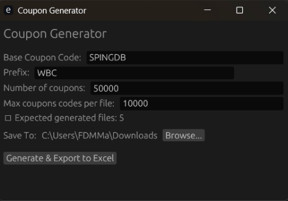
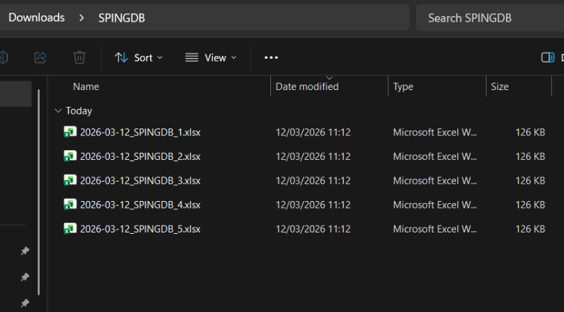
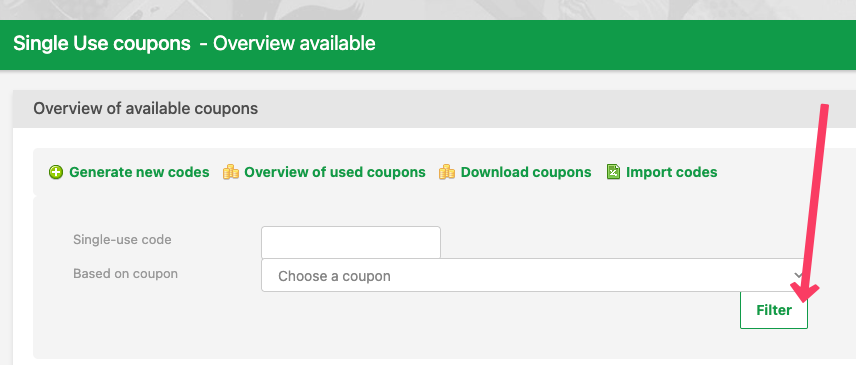
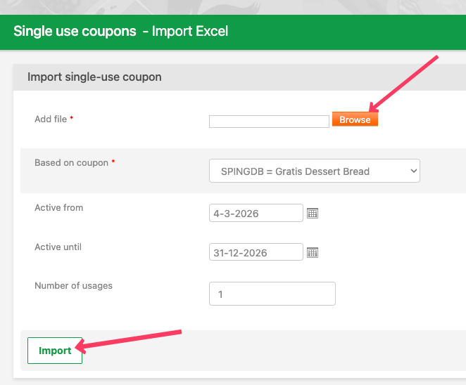

# 🎫 Coupon Generator

A high-performance desktop application for generating unique coupon codes and exporting them to Excel files. Built with Rust for speed and reliability.

---

## Table of Contents

1. [User Guidelines](#user-guidelines)
2. [Developer Documentation](#developer-documentation)

---

## User Guidelines

> **Core Objective:** Generate any number of unique, uppercase alphanumeric coupon codes and export them as organized Excel files — in seconds.

The workflow is divided into three mutually exclusive stages: **Configure → Generate → Retrieve**.



### 1. Configure — Set Up Your Batch

Before generating, you need to fill in four independent parameters:

| Parameter              | What It Controls                                    | Default   | Constraints                    |
|------------------------|-----------------------------------------------------|-----------|--------------------------------|
| **Base Coupon Code**   | Name used in the output file(s)                     | `COUPON`  | Up to 10 characters            |
| **Prefix**             | Fixed starting characters of every coupon code      | *(empty)* | 0–9 characters (case-insensitive; always output as uppercase) |
| **Number of Coupons**  | Total unique codes to generate                      | `100`     | Must be a positive integer     |
| **Max Codes per File** | How many codes go into each Excel file              | `10000`   | Must be a positive integer     |

**How the prefix works:**
- A coupon code is always **10 characters** long.
- The prefix occupies the first _N_ characters; the remaining `10 − N` characters are randomly generated from `A–Z` and `0–9`.
- Example: prefix `SAN` → codes like `SANX8F2QTK`, `SANBLM90WR`, etc.

### 2. Generate — Run the Process

1. **Choose an output directory (folder)** by clicking **Browse…** to select where files will be saved.
2. **Click "Generate & Export to Excel"** to start.
3. The status bar at the bottom will display progress and a confirmation message when complete.

### 3. Retrieve — Find Your Files

Generated files are saved to the directory you selected, with the naming convention:

```
{YYYY-MM-DD}_{BaseCouponCode}_{BatchNumber}.xlsx
```

**Examples:**
- `2026-03-12_COUPON_1.xlsx`
- `2026-03-12_COUPON_2.xlsx`

Each file starts with a first-row header named `codes`, followed by one coupon code per row. If your total count exceeds the **Max Codes per File** threshold, the coupons are automatically split across multiple numbered files.
These files are ready to import in S4D's Admin in the coupons > single use coupons > import section.

## Post Generation: Upload coupon codes to the S4D Admin

1. Go to the S4D Admin panel.
2. Navigate to the coupons section.
3. Select the "Single Use Coupons" option.
4. Click on the "Import" button.
5. Upload the generated Excel file(s) one by one.



---

## Developer Documentation

### Architecture

The application follows a clean three-module architecture:

```
src/
├── main.rs        # Entry point — launches the eframe/egui window
├── lib.rs         # Public library crate exposing generator & exporter
├── ui.rs          # GUI: input fields, validation, and status display
├── generator.rs   # Core: parallel coupon generation with uniqueness
└── exporter.rs    # I/O: splits coupons into batched Excel files
tests/
├── generator_tests.rs   # 16 tests covering happy path, errors, perf
└── exporter_tests.rs    # 12 tests covering splitting, naming, and workbook contents
```

**Data flow:** `UI (ui.rs)` → `Generator (generator.rs)` → `Exporter (exporter.rs)` → `.xlsx` files on disk.

### Key Technologies

| Crate               | Purpose                                            |
|----------------------|----------------------------------------------------|
| `eframe` / `egui`   | Immediate-mode GUI framework                       |
| `rayon`              | Data-parallel coupon generation                    |
| `dashmap`            | Lock-free concurrent `DashSet` for uniqueness      |
| `rand`               | Cryptographic-quality random character selection    |
| `rust_xlsxwriter`    | Native Excel `.xlsx` file creation                 |
| `chrono`             | Date formatting for file names                     |
| `rfd`                | Native file-dialog for directory selection          |
| `dirs`               | OS-aware default directory (Desktop)               |

### Module Details

#### `generator.rs`
- **`generate_coupons(prefix, count)`** — Returns `count` unique 10-character uppercase codes.
- Characters are drawn from `A–Z, 0–9` (36 symbols).
- Uses `rayon`'s `into_par_iter` for parallel batch generation.
- A `DashSet` enforces uniqueness without locks.
- Includes a `MAX_ATTEMPTS_MULTIPLIER` safety valve to prevent infinite loops.

#### `exporter.rs`
- **`export_to_excel(coupons, output_dir, base_name, max_per_file)`** — Splits the coupon list into chunks and writes each chunk to a separate `.xlsx` file.
- Files are named `{date}_{base_name}_{batch}.xlsx`.
- Each worksheet writes `codes` in the first row, then coupon values below it.

#### `ui.rs`
- `CouponApp` struct holds all UI state (prefix, counts, output directory, status).
- `handle_generate()` validates input, calls the generator, then the exporter.
- Displays an estimated file count before generation begins.

### Building

**Prerequisites:** [Rust toolchain](https://rustup.rs/) (edition 2021+).

```bash
# Run in development mode
cargo run

# Run the test suite
cargo test

# Run tests in release mode (recommended for the 10M perf test)
cargo test --release
```

#### macOS App Bundle

```bash
cargo install cargo-bundle   # one-time setup
cargo bundle --release
# Output: target/release/bundle/osx/Coupon Generator.app
```

#### Windows Cross-Compilation (from macOS)

```bash
cargo install cargo-xwin   # one-time setup
cargo xwin build --release --target x86_64-pc-windows-msvc
# Output: target/x86_64-pc-windows-msvc/release/coupon-generator.exe
```

### Testing

The project has **28 tests** across two test files:

| File                    | Tests | Coverage                                    |
|-------------------------|-------|---------------------------------------------|
| `generator_tests.rs`    | 16    | Correctness, uniqueness, prefix handling, edge cases, performance (50K & 10M codes) |
| `exporter_tests.rs`     | 12    | File splitting, naming convention, empty input, file existence, workbook headers |

Run all tests:

```bash
cargo test --release
```

---

## License

*Not yet specified.*
